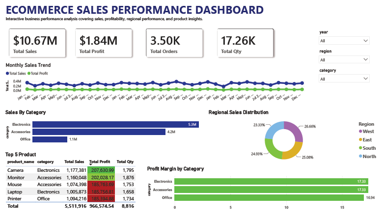

# E-Commerce Sales Analysis Dashboard

## Overview

This project analyzes e-commerce sales performance using **MySQL** and **Power BI** to generate business insights related to sales trends, profitability, regional performance, and product analysis.

The project demonstrates a complete end-to-end data analyst workflow, including:

* Data Cleaning
* Exploratory Data Analysis (EDA)
* Business Analysis
* Dashboard Development
* Data Storytelling

---

## Dashboard Preview



---

## Business Problem

Businesses require centralized reporting to monitor sales performance, profitability, and operational efficiency.

This project transforms raw transactional sales data into interactive business intelligence dashboards that support data-driven decision making.

---

## Objectives

The objectives of this project are to:

* Analyze overall sales and profitability performance
* Identify top-performing product categories
* Monitor monthly sales trends
* Understand regional sales distribution
* Evaluate top-performing products
* Present insights through an executive-style dashboard

---

## Tools & Technologies

| Tools       | Purpose                      |
| ----------- | ---------------------------- |
| MySQL       | Data Cleaning & SQL Analysis |
| Power BI    | Dashboard Visualization      |
| DAX         | KPI Calculations             |
| CSV Dataset | Raw Data Source              |

---

## Project Workflow

### 1. Data Cleaning (MySQL)

Data cleaning process included:

* Renaming columns
* Converting date formats
* Checking null values
* Validating numeric fields
* Checking duplicate records

SQL scripts are available in:

```text
/sql
```

---

### 2. Exploratory Data Analysis

SQL analysis performed:

* Total sales analysis
* Profitability analysis
* Monthly trend analysis
* Category performance analysis
* Regional performance analysis
* Product performance analysis

---

### 3. Dashboard Development (Power BI)

The interactive dashboard includes:

* KPI Cards
* Monthly Sales Trend
* Category Sales Analysis
* Regional Sales Distribution
* Top Product Analysis
* Profit Margin Analysis
* Interactive Filters

PBIX dashboard file available in:

```text
/powerbi
```

---

## Dashboard Features

| Feature             | Description                   |
| ------------------- | ----------------------------- |
| KPI Monitoring      | Tracks core business metrics  |
| Trend Analysis      | Monthly sales & profit trends |
| Category Analysis   | Product category performance  |
| Regional Analysis   | Geographic sales contribution |
| Product Analysis    | Top-performing products       |
| Interactive Filters | Dynamic dashboard exploration |

---

## Key Business Insights

### Sales Performance

* Total sales reached **$10.67M**
* Total profit exceeded **$1.84M**
* More than **3.5K orders** were analyzed

### Category Analysis

* Electronics generated the highest sales revenue
* Accessories ranked second in sales contribution
* Office category contributed the lowest sales

### Regional Analysis

* West region contributed the highest sales share
* Sales distribution remained relatively balanced across all regions

### Profitability

* Profit margins remained healthy across categories
* High-revenue categories also delivered strong profitability

---

## Repository Structure

```text
ecommerce-sales-analysis/
│
├── dataset/
├── sql/
├── powerbi/
├── screenshots/
├── documentation/
└── README.md
```

---

## Skills Demonstrated

This project demonstrates:

* SQL Querying
* Data Cleaning
* Exploratory Data Analysis
* Business Analysis
* Dashboard Development
* DAX Measures
* Data Visualization
* Data Storytelling
* Business Intelligence Reporting

---

## Project Files

| Folder        | Contents                            |
| ------------- | ----------------------------------- |
| dataset       | Raw dataset                         |
| sql           | SQL scripts                         |
| powerbi       | Power BI dashboard                  |
| screenshots   | Dashboard preview images            |
| documentation | Business insights & project summary |

---

## Final Conclusion

This project simulates a real-world business intelligence workflow by transforming raw transactional data into executive-level reporting and actionable business insights.

The dashboard was designed with a clean and professional layout to support strategic business monitoring and performance analysis.

---
